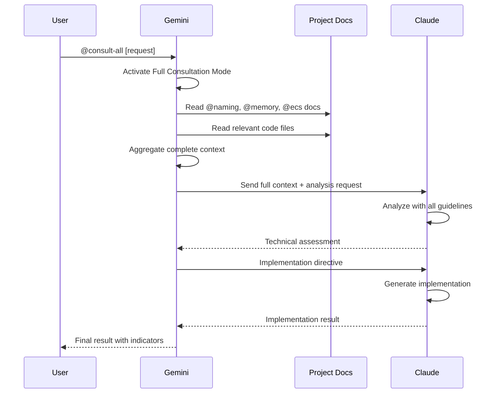

# Feature Specification: @consult-all Command

## Document Governance

| Field | Details |
|-------|---------|
| **Status** | Draft |
| **Author(s)** | Claude Code Assistant |
| **Reviewer(s)** | TBD |
| **Last Updated** | 2025-01-26 |

---

## 1. Feature Overview & Scope

### What is the core purpose of this feature?
The @consult-all command enforces mandatory consultation with Claude on ALL technical decisions and implementations. When activated, Gemini must aggregate comprehensive project context including naming conventions, memory efficiency guidelines, and code practices, then consult Claude before making any technical decision or generating any code.

### Who is the intended audience or consumer of this feature?
- Developers working with the Gemini-Claude collaborative system
- Teams requiring strict adherence to project standards and best practices
- Projects where code quality and architectural consistency are paramount

### What is IN SCOPE?
- Mandatory Claude consultation for all technical decisions
- Automatic aggregation of project documentation (@naming, @memory, @ecs)
- Full context sharing including all relevant files and conversation history
- Structured consultation format with visual indicators
- Persistent activation throughout the conversation session

### What is explicitly OUT OF SCOPE?
- Bypassing Claude for any technical implementation
- Partial context sharing or summarization
- Automatic deactivation without explicit user command
- Non-technical tasks (documentation reading, file listing without analysis)

---

## 2. Architectural Rationale (The "Why")

### Architecture Decision Record (ADR-01)

**Decision Title**: Enforce Comprehensive Context Aggregation Before Consultation

**Context & Problem**:
Gemini has significantly larger context window than Claude. Without proper context aggregation, Claude may make suboptimal decisions due to missing information about project standards, existing patterns, or cross-cutting concerns.

**The Decision**:
Gemini must aggregate ALL relevant context including complete file contents, documentation, and conversation history before consulting Claude. No summarization is allowed.

**Alternatives Considered**:
1. Selective context sharing: Rejected because it risks missing critical information
2. Summary-based approach: Rejected as it loses implementation details crucial for adherence to standards
3. Incremental consultation: Rejected as it fragments decision-making context

**The Trade-Offs (Pros & Cons)**:
- **Pros**: Ensures Claude has complete information, maintains code quality standards, prevents architectural drift
- **Cons**: Higher token usage, longer response times, requires Gemini to read more files upfront

### Architecture Decision Record (ADR-02)

**Decision Title**: Visual Status Indicators for Transparency

**Context & Problem**:
Users need clear visibility into when Gemini is consulting Claude and what information is being shared to maintain trust and understanding of the collaborative process.

**The Decision**:
Use emoji-based status indicators (🔴, 📋, 🤝, 📡, ✅, 🎯) to show each phase of the consultation process with clear descriptions of actions being taken.

**Alternatives Considered**:
1. Silent consultation: Rejected due to lack of transparency
2. Text-only status: Rejected as less visually distinct
3. Minimal indicators: Rejected as insufficient for user understanding

**The Trade-Offs (Pros & Cons)**:
- **Pros**: Clear visual feedback, builds user trust, aids debugging
- **Cons**: More verbose output, requires consistent formatting

---

## 3. How It Works (Diagram & API)

### Visual Logic



### The Command Interface

```markdown
## Command Syntax
@consult-all [technical request]

## Activation Triggers
- Explicit: "@consult-all" anywhere in user message
- Remains active for entire conversation
- Deactivation: "disable @consult-all"

## Required Context Elements
1. Complete file contents (no summaries)
2. Full documentation set:
   - @naming (Naming Conventions and Code Practices)
   - @memory (CPU Memory-Efficient Code Guidelines)
   - @ecs (ECS Architecture Best Practices)
   - @architecture (Core Engine Architecture)
3. Complete conversation history
4. All error messages and logs
5. Project overview documentation
```

---

## 4. How to Use It (Implementation Examples)

### Step-by-Step Usage

1. **User activates the command**:
   ```
   @consult-all implement a new physics component
   ```

2. **Gemini enters Full Consultation Mode**:
   - Shows 🔴 FULL CONSULTATION MODE ACTIVE
   - Begins context aggregation

3. **Context gathering phase**:
   - Reads all relevant files
   - Loads required documentation
   - Shows progress with 📋 indicator

4. **Claude consultation**:
   - Sends complete context with 🤝 indicator
   - Waits for response with 📡 indicator
   - Shows assessment with ✅ indicator

5. **Implementation directive**:
   - Provides detailed instructions with 🎯 indicator
   - Claude implements following all guidelines

### Complete Usage Example

```
User: "@consult-all create a new video decoding component"

Gemini Response:
🔴 FULL CONSULTATION MODE ACTIVE

📋 Gathering comprehensive context...
- Reading video subsystem files:
  - /app/polaris/source/runtime/components/video.h (850 lines)
  - /app/polaris/source/runtime/systems/video_player.cpp (1200 lines)
  - /app/polaris/source/runtime/systems/video_decoder.cpp (980 lines)
- Loading @naming conventions (full document)
- Loading @memory efficiency guidelines (full document)
- Loading @ecs best practices (full document)
- Loading existing component patterns from 12 files

🤝 Consulting Claude with full context...

Ask Claude: Based on:
- Complete video subsystem implementation: [full contents of all files]
- Naming conventions requiring:
  - 'C' prefix for components (e.g., CVideoDecoder)
  - Data-oriented design principles
  - Minimal component state
- Memory efficiency requirements:
  - Use smallest possible data types
  - Optimize struct alignment
  - Bulk processing patterns
- ECS patterns using Flecs:
  - Handle-based references
  - System queries optimization
- User requirement: Create new video decoding component

Please analyze and provide:
1. Technical feasibility assessment
2. Performance implications  
3. Architecture alignment check
4. Implementation approach following all guidelines
5. Potential risks or issues

📡 Waiting for comprehensive analysis...

✅ Received Claude's assessment:
[Claude's detailed technical analysis]

🎯 Implementation directive to Claude:
Based on your analysis, please implement the CVideoDecoder component with:
- Proper 'C' prefix naming convention
- Memory-aligned struct layout
- Handle-based asset references
- Integration with existing video pipeline
- Following all data-oriented design principles from @memory guidelines
```

---

## 5. Important Contracts & Guarantees

### Behavioral Guarantees
- **Complete Context**: Always provides full file contents and documentation, never summaries
- **Mandatory Consultation**: Every technical decision goes through Claude when active
- **Persistent Activation**: Remains active for entire conversation unless explicitly disabled
- **Transparency**: All consultation steps are visually indicated to the user

### Error Handling
- If Claude is unavailable: Gemini must inform user and cannot proceed with technical tasks
- If documentation is missing: Gemini must attempt to locate it before consultation
- If context exceeds limits: Gemini must prioritize most relevant context while informing user

### Performance Characteristics
- **Initial Overhead**: 10-30 seconds for context aggregation depending on project size
- **Consultation Latency**: Additional 5-15 seconds for Claude analysis
- **Quality Trade-off**: Significantly higher code quality and standard adherence vs. speed